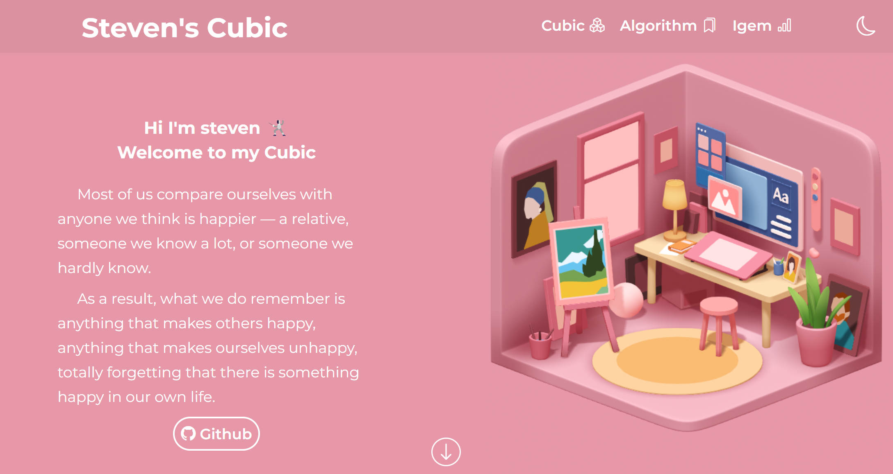
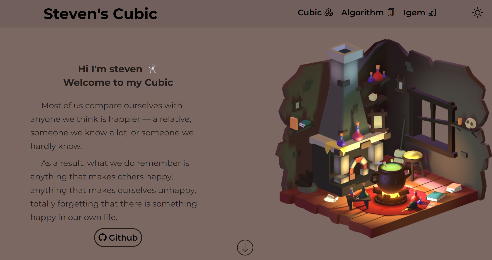
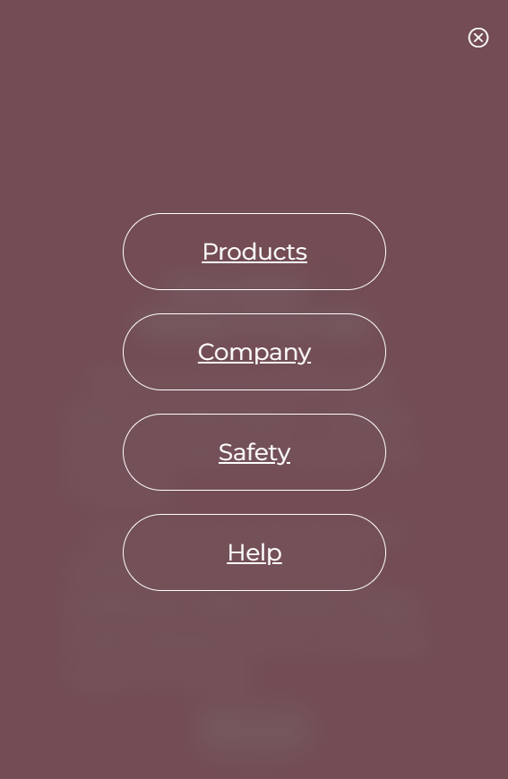
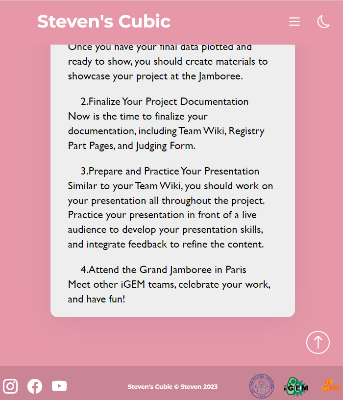
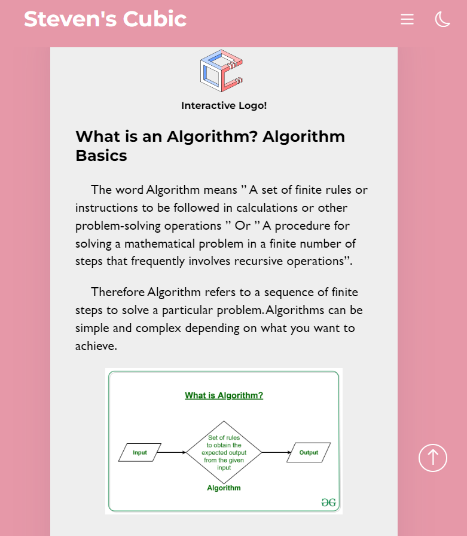
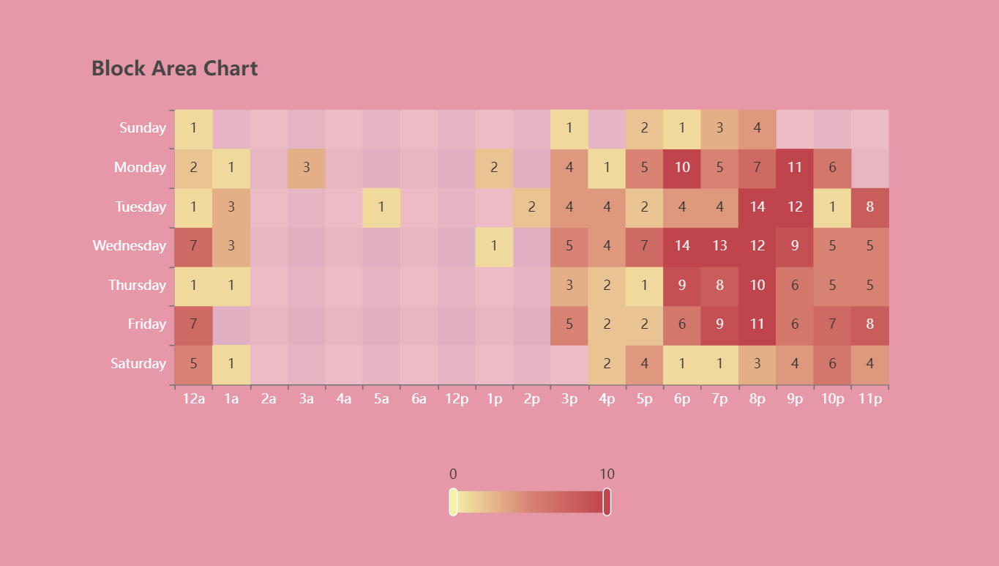
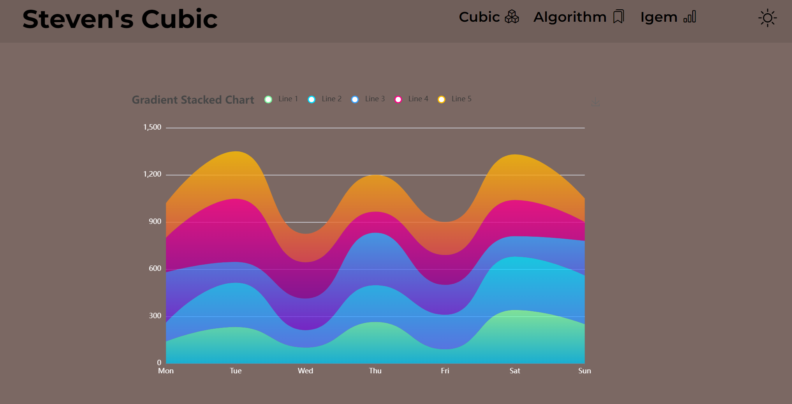

使用vite开发工具
```bash
git clone ...
cd ./.../
安装依赖
npm install
启动
npm run dev
访问本地端口
http://localhost:5174/
```

演示网址 [Demo](https://steven-cubic.vercel.app/)

主页面 默认跟随系统
切换
- cubic 下拉选项框
- 右上角的主题按钮
颜色
- 浅色模式

- 深色模式

由于有3D模型， 首屏加载速度较慢

实现响应式布局，在手机上也能有较好的显示效果
- 特殊设计的菜单
- 
- flex 布局
- 
- 

可交互3D模型 spline.js导入

图标 boostrap5 icon

动画
- css原生
- animate.css
- gsap js动画

数字跳动 CountUp.js

图表 Echarts
- https://echarts.apache.org/examples/zh/index.html

- 
- 


数学公式 Mathjax
- 


3d模型来源
- Spline 官网示例 https://app.spline.design/library

设计参考
- HZAU-china https://2021.igem.org/Team:HZAU-China/Team

正文内容来源
- iGEM 流程 https://blog.igem.org/blog/the-igem-cycle-how-to-navigate-the-igem-competition